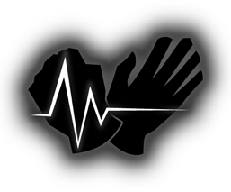

  
  <h1>Robots, Software, Code and Workshop</h1>
  <h3> Metal Atelier </h3>
   
  
A team mainly focused on the area of robotics, Metal Atelier is an aspiring team founded with the vison of making the best posible, high quality and durable robots, each built with love and purpose for the craft; our craft. Having dedicated teams, each one of them focuses on an aspect of robotics and competitions, like Robosumo, allowing us to innovate, collaborate, and continuously push the boundaries of what we can create together.

> If you'd like to join the team, please reach out to our leader (
[@LifelagCheats](https://github.com/LifelagCheats)
) and share your interest—we’re always looking for passionate individuals ready to learn, build, and grow with us.
